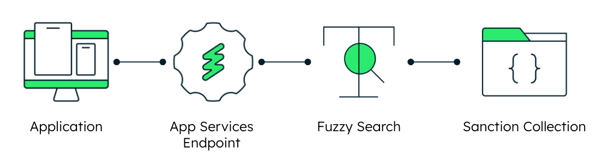

# Installation of the serverless function

In this part we will set up your own microservice with MongoDB's app services. So if you haven't already start by [creating your own App Services application](https://www.mongodb.com/docs/atlas/app-services/apps/create/).

## Getting Started

First we need to activate the Email/password authentication.
- From the App Services application navigate to Authentication using the left menu.
- Then find "Allow users to log in anonymously" and click on edit.
- Enable it, save it and when prompted select "Review draft & deploy", and then "Deploy".

We need to create an Atlas function for the vector.js file. To do so:
- From the App Services application navigate to "Functions" using the left menu.
- Click the green "create New Function" button in the top right corner.
- Name the function, we chose “Fuzzy” as this will be used to do some fuzzy search.
- Select "System" as the authentication method.
- Then click on the "function editor" tab on the top.
- And replace the default code with vector.js. You just need to copy/paste the code.
- Select "Save draft". 
- When prompted select "Review draft & deploy", and then "Deploy".

> [!Note]
> MongoDB fuzzy search finds documents even if there are small errors or variations in the search terms, making it easier to retrieve relevant information from the database.

> [!Warning]
> By allowing the anonymous log ins, and setting the system authentication on the function, we have made the function public. Should you want to protect it your function please refer to our documentation to [set up an authentication method](https://www.mongodb.com/docs/atlas/app-services/authentication/) such as Email/Password, API Key, Custom JWT and others.

Finally, for the Fuzzy function we will create a HTTPS endpoint:
- From the App Services application navigate to "HTTPS Endpoint" using the left menu.
- Then click the green "Add an Endpoint" button in the top right corner.
- Set "/fuzzy" as the Route (you can also choose whatever you want).
- Save somewhere safe the URL for your endpoint. It's located under “Operation type”.
- Set the HTTP method to "POST".
- Activate "Respond With Result".
- select the "fuzzy" function (or whatever you called it).
- Activate "Create User Upon Authentication"
- And don't forget to save and deploy

This setup has allowed us to open an API where we can query the name of the individuals in the transaction against a sanction database. The reason why we implemented it with Fuzzy search, it's because this type of list often includes names that aren't usually spelled with the latin script. Therefore, a search that accounts for some spelling variations can be useful.

> [!Note]
> The URL will need to go on the NEXT_PUBLIC_FUZZY_URL parameter on the <location_of_your_repo>/AML-Fraud-prevention-Demo/frontend/.env file.

Once you have done everything, we can move on to the next part:
- [Installation of the backend](../backend/)
- Or go back [to the main page](../)