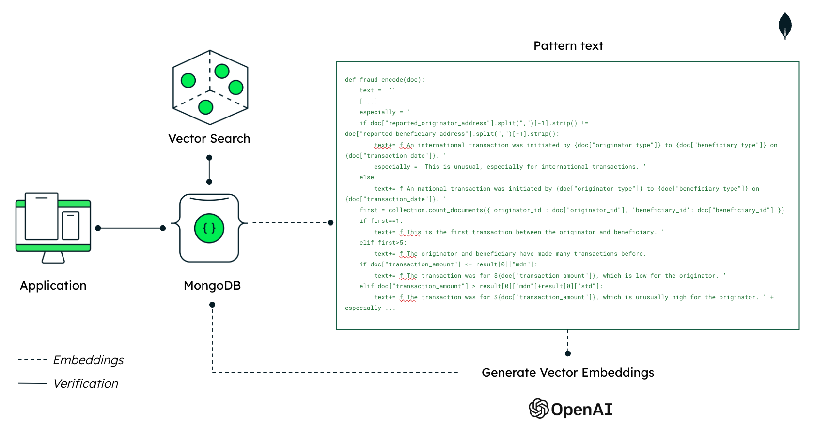

# Installation of the backend

These are some simple APIs built on Python.

## Getting Started

First, make sure that you have all of the requirements installed in your Python instance:

```bash
pip install -r requirements.txt
# or
pip3 install -r requirements.txt
```

> [!Warning]
> Please keep in mind that these are different from the ones in the <location_of_your_repo>/AML-Fraud-prevention-Demo/dataScripts/requirements.txt file.

Next, please make sure to add a .env file in the folder <location_of_your_repo>/AML-Fraud-prevention-Demo/backend. It should include the following:

```md
MONGODB_URI=<Your_connection_string>
MONGODB_DB=AML_Fraud_detection
OPENAI_API_KEY=<Your_OpenAI_api_key>
```

Lastly, run the bankend services:

```bash
python app.py
# or
python3 app.py
# or if you are running it on a server
pm2 start app.py --interpreter=python3
```
> [!Warning] 
> If you want to deploy this on a server, then you will need to install pm2, on top of the requirements. You will also need to call the APIs with the server's API which will need to be updated on the <location_of_your_repo>/AML-Fraud-prevention-Demo/frontend/.env file.

You should have two APIs:
- http://localhost:8080/embedings?_id=<id_of_the_document_you_want_to_add_embeddings_to>
- http://localhost:8080/verification?_id=<id_of_the_document_you_want_to_verify>

Both flows for AML and Fraud work the same way. We generate a text description of the transaction. These texts are, of course, going to describe different things for AML and Fraud, as we focus on different information for each of them. For example, for Fraud, we will focus on the number of transactions in the last hour, the number of transactions, and whether or not the transaction is national or international. For AML, we will focus on inconsistencies or whether or not there is any shared contact information between the originator and the beneficiary. If you are more interested in this, you can check the AML_encode and fraud_encode functions in the app.py file in this folder.



As you can see from the image above, the Embeddings API will generate both the pattern text and the Embedding and insert it into the database. The second API is the Verification one, this is where we will check if the transaction will indeed be flagged for AML or Fraud. Its logic is to ask for 4000 similar transactions thanks to vector search. Then we will see the proportion of flagged transactions amongst the similar transactions. If there are at least 50% of them that have been flagged then the transaction will be flagged too.

Once you have done everything, we can move on to the next part:
- [Installation of the frontend](../frontend/)
- Or go back [to the main page](../)